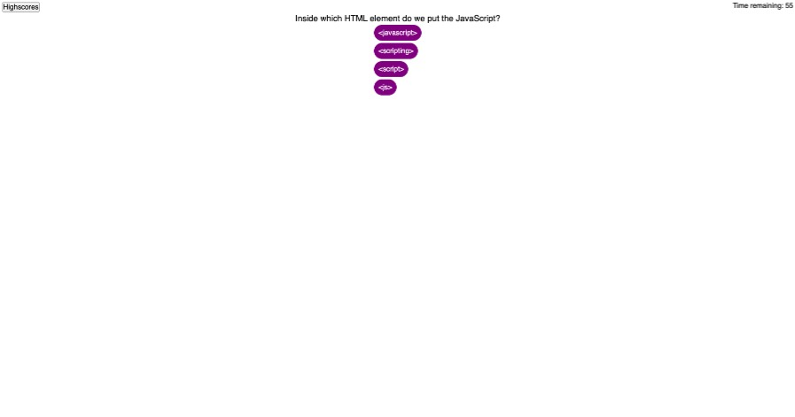

# JavaScript Quiz

## Description

This project was used to test my ability at using Web APIs. The product is a short JavaScript quiz that keeps track of time and score as you go though the quiz. After completing the quiz you recieve your score and you can store it to the highscore page.  This project has taught me how useful it will be in the future to get to use third party APIs. If I would have used jQuery for example a lot of my js code could have been shorter. This was also the first project where I experimented with hideing certain sections of a page while another is present. This caused some problems that had to be sorted out as they arrised.

## Table of Contents

N/A

## Installation

N/A

## Usage

To use this project start by clicking the "Test your Knowledge" button. You will be asked to answer 5 multiple choice questions. You earn points for every question you get correct and you lose time for every question you get wrong. The quiz ends when you get through all the questions or you run out of time. After the quiz you get to save your score to the highscore page. You can access the highscore page after submiting yours or by pressing the "Highscores" button in the top left of the screen. You can also clear the highscore list if you want to start the list over.

Live site: https://codysaal.github.io/basic_code_quiz/

## Credits

I found a javascript quiz on W3Schools that I used in order to find 5 questions on javascript. You can find that quiz here: https://www.w3schools.com/quiztest/quiztest.asp?qtest=JS 

## License

N/A

